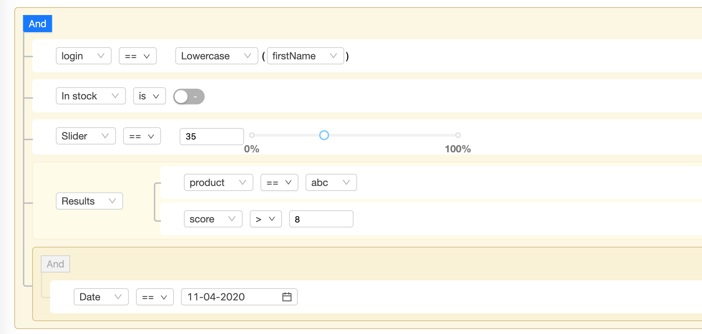

## 参考
* https://ukrbublik.github.io/react-awesome-query-builder/
* https://github.com/zengxijin/react-awesome-query-builder



## 算子表达式结构
### Tree
```json
{
  "type": "group",
  "id": "9a99988a-0123-4456-b89a-b1607f326fd8",
  "children1": {
    "a98ab9b9-cdef-4012-b456-71607f326fd9": {
      "type": "rule",
      "properties": {
        "field": "user.login",
        "operator": "equal",
        "value": [
          {
            "func": "LOWER",
            "args": {
              "str": {
                "valueSrc": "field",
                "value": "user.firstName"
              }
            }
          }
        ],
        "valueSrc": [
          "func"
        ],
        "valueType": [
          "text"
        ]
      }
    },
    "98a8a9ba-0123-4456-b89a-b16e721c8cd0": {
      "type": "rule",
      "properties": {
        "field": "stock",
        "operator": "equal",
        "value": [
          false
        ],
        "valueSrc": [
          "value"
        ],
        "valueType": [
          "boolean"
        ]
      }
    },
    "aabbab8a-cdef-4012-b456-716e85c65e9c": {
      "type": "rule",
      "properties": {
        "field": "slider",
        "operator": "equal",
        "value": [
          35
        ],
        "valueSrc": [
          "value"
        ],
        "valueType": [
          "number"
        ]
      }
    },
    "aaab8999-cdef-4012-b456-71702cd50090": {
      "type": "rule_group",
      "properties": {
        "conjunction": "AND",
        "field": "results"
      },
      "children1": {
        "99b8a8a8-89ab-4cde-b012-31702cd5078b": {
          "type": "rule",
          "properties": {
            "field": "results.product",
            "operator": "select_equals",
            "value": [
              "abc"
            ],
            "valueSrc": [
              "value"
            ],
            "valueType": [
              "select"
            ]
          }
        },
        "88b9bb89-4567-489a-bcde-f1702cd53266": {
          "type": "rule",
          "properties": {
            "field": "results.score",
            "operator": "greater",
            "value": [
              8
            ],
            "valueSrc": [
              "value"
            ],
            "valueType": [
              "number"
            ]
          }
        }
      }
    },
    "b9bbabaa-cdef-4012-b456-71716685f181": {
      "type": "group",
      "properties": {
        "conjunction": "AND"
      },
      "children1": {
        "9ba8aabb-89ab-4cde-b012-31716685f183": {
          "type": "rule",
          "properties": {
            "field": "date",
            "operator": "equal",
            "value": [
              "2020-04-11"
            ],
            "valueSrc": [
              "value"
            ],
            "valueType": [
              "date"
            ]
          }
        }
      }
    }
  },
  "properties": {
    "conjunction": "AND",
    "not": false
  }
}
```

### jsonLogic
* exp
```json
{
  "and": [
    {
      "==": [
        {
          "var": "user.login"
        },
        {
          "method": [
            {
              "var": "user.firstName"
            },
            "toLowerCase"
          ]
        }
      ]
    },
    {
      "==": [
        {
          "var": "stock"
        },
        false
      ]
    },
    {
      "==": [
        {
          "var": "slider"
        },
        35
      ]
    },
    {
      "and": [
        {
          "<=": [
            10,
            {
              "var": "results.score"
            },
            100
          ]
        },
        {
          "in": [
            {
              "var": "results.product"
            },
            [
              "abc",
              "def",
              "xyz"
            ]
          ]
        }
      ]
    },
    {
      "and": [
        {
          "==": [
            {
              "var": "results.product"
            },
            "abc"
          ]
        },
        {
          ">": [
            {
              "var": "results.score"
            },
            8
          ]
        }
      ]
    },
    {
      "==": [
        {
          "var": "date"
        },
        "2020-04-10T16:00:00.000Z"
      ]
    }
  ]
}
```

* data
```json
{
  "user": {
    "firstName": null,
    "login": null
  },
  "stock": null,
  "slider": null,
  "results": {
    "score": null,
    "product": null
  },
  "date": null
}
```

